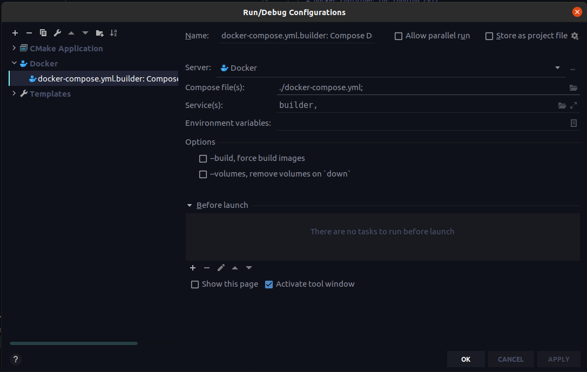
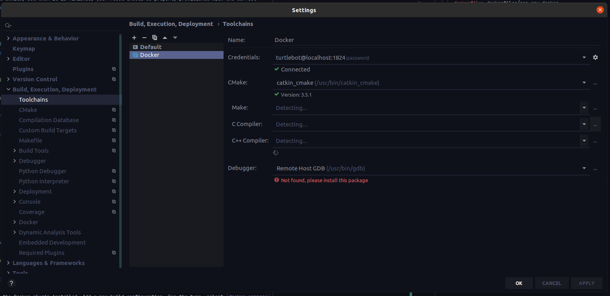
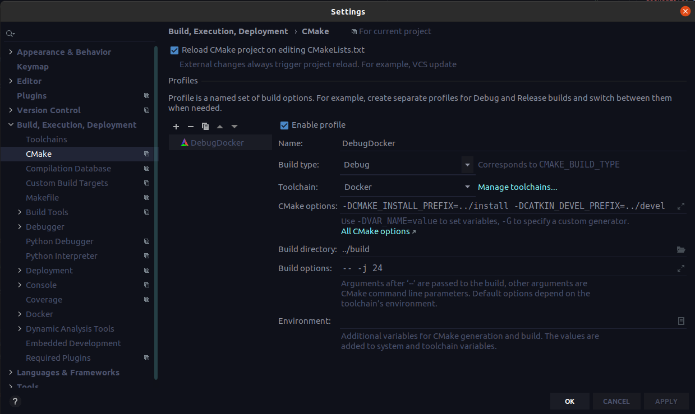
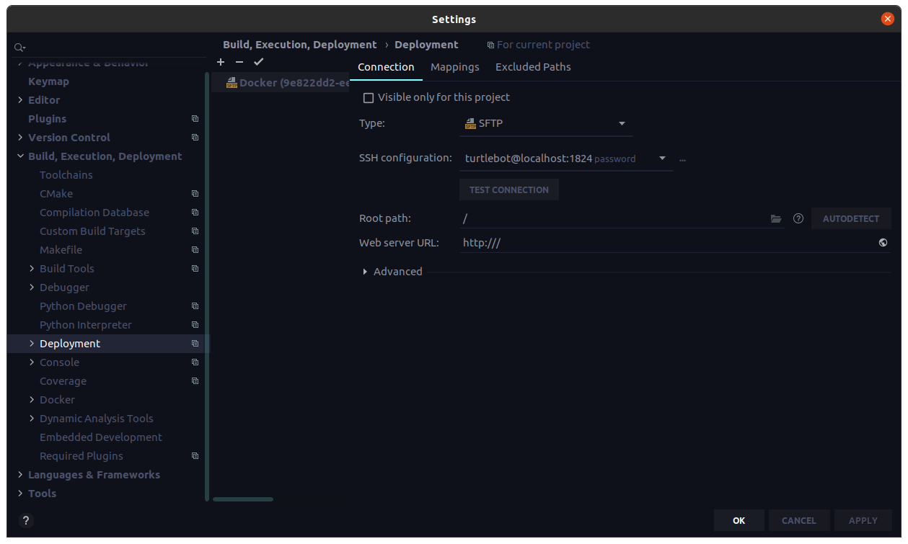
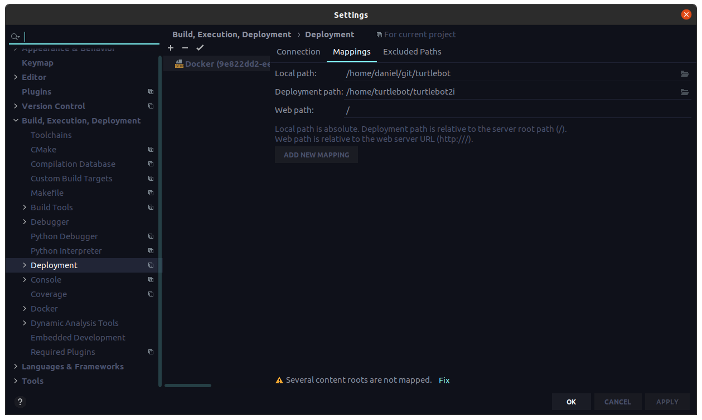
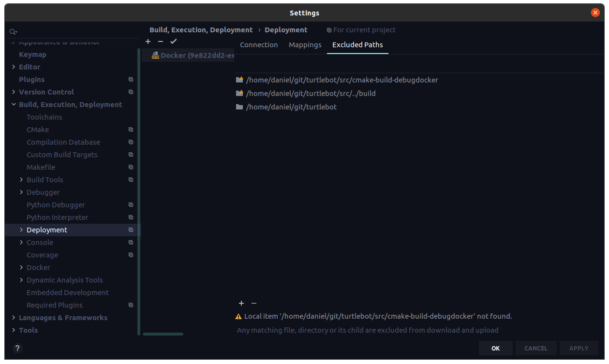

# Turtlebot 2i Exploration Code

This is the complete source code for the exploration demo that I wrote for the Turtlebot 2i platform. As well as all
the actual source code, it also includes various utilities for configuring the robot and running the code.

# Provisioning the Robot

Provisioning the robot can be done via [Ansible](https://www.ansible.com/). 

## Prerequisites

Note that I have only tested this on a robot with a completely fresh Ubuntu 16.04 installation. If you already 
have other stuff installed, YMMV. I have configured a `turtlebot` user on the robot, with the password "turtlebot", and
access to `sudo`. Make sure that your robot is also connected to the internet via WiFi before you start.

A note on 64-bit vs 32-bit: I have seen some Turtlebots come pre-installed with 32-bit OSes. If this is the case for
yours, *it will not work*! You have no choice but to re-install a 64-bit version from scratch.

Also note that these instructions assume your host machine is running a recent version of Ubuntu.

## Steps

1. Install Ansible: `pip install --user ansible`

1. Edit the [hosts.yml](https://github.com/djpetti/turtlebot2i/blob/develop/hosts.yml#L7) file,
changing the listed IP address to the actual IP address of your robot.
   
1. Run the provisioning playbook: `ansible-playbook -i hosts.yml -u turtlebot -K provision_turtlebot.yml`

This process will take awhile, but when it is finished, your robot should be properly provisioned with the correct
version of all software packages installed.

# Building the Code

The code is built in Docker, in an attempt to minimize the amount of system configuration necessary in order to build
it. Therefore, [Docker must be installed](https://docs.docker.com/engine/install/ubuntu/) on your host machine.
A new-ish [version of `docker-compose`](https://docs.docker.com/compose/install/) is also necessary.

## Building the Code Manually

1. Build the Docker image: `docker-compose build`

1. Run the Docker container: `docker-compose up -d builder`

1. SSH into the container: `ssh -p 1824 turtlebot@localhost`. The password is "password".

1. Build the code: 
```shell
cd turtlebot2i
mkdir -p build
cd build

catkin_cmake ..
make -j $(nproc)
```

5. Exit the SSH session.

After building, you can deploy the code to the robot. Replace `ROBOT_IP` with the IP address of your robot.
`scripts/deploy.sh turtlebot@ROBOT_IP`

## Building the Code with CLion

If you are already using the CLion IDE, the build process is designed to integrate well with it.

### One-Time Configuration

1. Make sure you have the Docker plugin installed. Add a new build configuration. For the type, select `docker-compose`.
Use "docker-compose.yml" as the compose file, and select the "builder" service. The first time you run this
   configuration, it will have to build the Docker image, which will take awhile. After it is done, it should start
   the builder service successfully. You will have to keep this configuration running whenever you are building the
   Turtlebot code.
   


2. Go to "Settings > Build, Execution, Deployment > Toolchains". Add a new "Remote Host" toolchain. For the credentials,
use "turtlebot" as the username, "localhost" as the host, and "1824" as the port. Change the CMake executable to
   `/usr/bin/catkin_cmake`.
   


3. Go to the "CMake" tab, and add a new profile. Configure it as shown below. (You can delete the default profile, as
   it won't work correctly anyway.)
   


4. Go to the "Deployment" tab. A deployment configuration should have already been automatically created.



Set the path mappings as shown, substituting the actual path to the repository on your disk for the source path.



Set the repository root as an excluded path, as shown by the last item in the configuration below.



### Building the Code

Once CLion is configured, you should be able to successfully load the CMake project. After this, you can build CMake
targets as you would normally.

After building, you can deploy the code to the robot. Replace `ROBOT_IP` with the IP address of your robot.
`scripts/deploy.sh turtlebot@ROBOT_IP`

# Running the Code

Once the code has been deployed to the robot, running it is straightforward.

1. SSH into the robot, and `cd turtlebot2i`.
1. Start ROS: `scripts/start_ros.sh`.